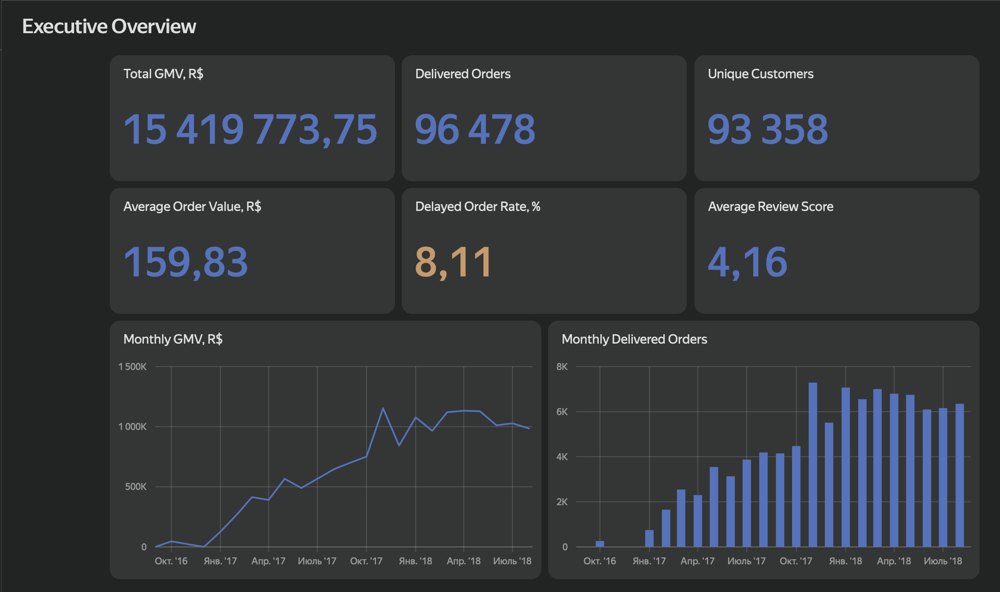
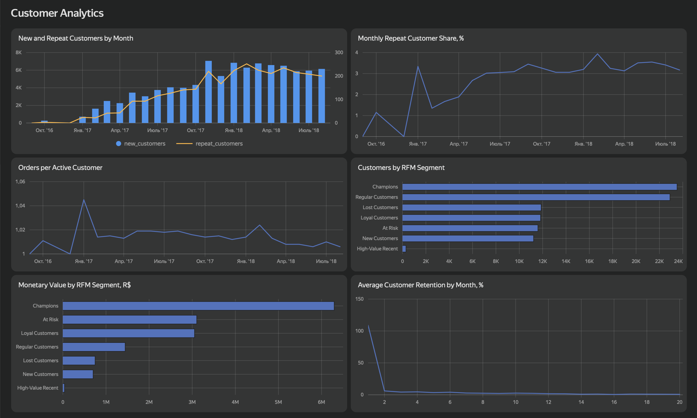
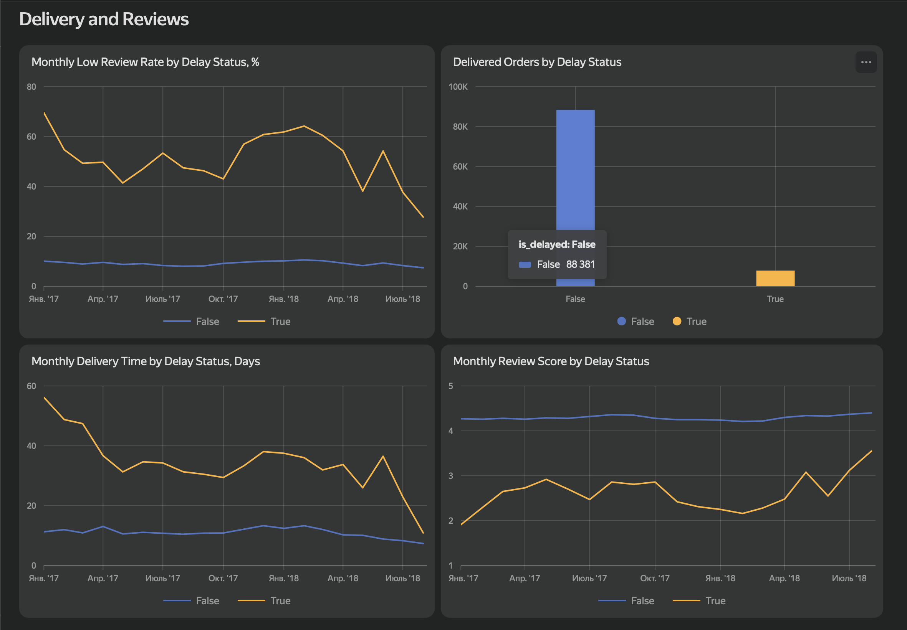
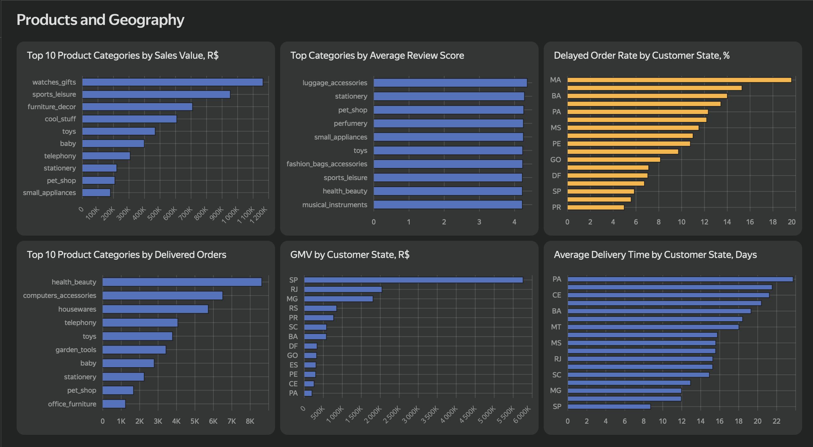

# E-commerce Product Analytics

## Project Overview

This project analyzes the Brazilian Olist marketplace dataset as an end-to-end data analytics case study. It starts with raw marketplace CSV files, loads them into PostgreSQL, builds a reusable SQL analytics layer, explores business and customer behavior in Python notebooks, exports aggregated dashboard marts, and documents a Yandex DataLens dashboard.

The goal is to understand marketplace growth, customer retention, product and geographic performance, delivery quality, review satisfaction, and the feasibility of analytical models for experimentation and low-review risk prediction. The analysis is historical and observational; it does not claim causal impact from non-experimental data.

## Business Questions

- How did marketplace order volume, gross merchandise value (GMV), and average order value evolve over time?
- Was growth driven more by new customer acquisition or repeat purchasing?
- How strong is customer retention after the first delivered order?
- Which customer segments contribute the most monetary value under Recency, Frequency, Monetary (RFM) segmentation?
- How are delivery delays associated with review scores and low-review rates?
- Which product categories and customer states generate the most value and operational risk?
- Which statistical relationships are meaningful in practice, not only statistically significant?
- What would a simulated A/B test for improving repeat purchase conversion look like?
- Can delivered orders with a high risk of receiving a low review score be identified after delivery?

## End-to-End Pipeline

```text
Olist CSV files
    -> Python ETL
    -> PostgreSQL raw schema
    -> SQL analytics layer
    -> Python notebooks
    -> exported dashboard marts
    -> Yandex DataLens dashboard
```

Raw Olist CSV files are placed in `data/raw/`. The ETL pipeline creates PostgreSQL schemas and raw tables, loads and validates the source files, creates analytics views, and validates row counts. The notebooks query PostgreSQL directly. The dashboard export script writes aggregated CSV marts to `dashboard/data/`, which are then used in Yandex DataLens.

Raw CSV files and generated dashboard CSV files are excluded from Git because they are reproducible local data artifacts.

## Technology Stack

- Python
- pandas
- NumPy
- SciPy
- statsmodels
- scikit-learn
- SQLAlchemy
- psycopg2
- python-dotenv
- PostgreSQL
- SQL
- Jupyter Notebook
- Matplotlib
- Seaborn
- Yandex DataLens
- DBML
- Git

## Repository Structure

```text
e-commerce product analytics/
├── .env.example
├── .gitignore
├── README.md
├── dashboard/
│   ├── dashboard_design.md
│   ├── export_dashboard_data.py
│   └── screenshots/
│       ├── Customer_Analytics.png
│       ├── Delivery_and_Reviews.png
│       ├── Executive_Overview.png
│       └── Products_and_Geography.png
├── database/
│   ├── 01_create_schemas.sql
│   ├── 02_create_raw_tables.sql
│   ├── 03_validate_raw_data.sql
│   ├── 04_create_analytics_layer.sql
│   └── 05_validate_analytics_layer.sql
├── docs/
│   ├── database_design.md
│   ├── er_diagram.png
│   └── olist_schema.dbml
├── etl/
│   ├── config.py
│   ├── load_raw_data.py
│   └── run_pipeline.py
├── notebooks/
│   ├── 01_eda.ipynb
│   ├── 02_product_metrics.ipynb
│   ├── 03_cohort_analysis.ipynb
│   ├── 04_rfm_segmentation.ipynb
│   ├── 05_statistical_analysis.ipynb
│   ├── 06_ab_test_simulation.ipynb
│   └── 07_low_review_prediction.ipynb
└── requirements.txt
```

Local files not tracked by Git include `.env`, `data/raw/*.csv`, `dashboard/data/*.csv`, Python caches, and operating-system artifacts.

## Database Architecture

The PostgreSQL database is organized into two schemas: `raw` and `analytics`.

The `raw` schema stores source-aligned tables loaded from the original CSV files:

- `raw.category_translation`
- `raw.customers`
- `raw.orders`
- `raw.sellers`
- `raw.products`
- `raw.order_items`
- `raw.payments`
- `raw.reviews`
- `raw.geolocation`

The raw tables define primary keys, foreign keys, data types, and checks for non-negative monetary values and valid review scores. The geolocation table uses a generated `geolocation_id` because ZIP code prefixes are not unique in the source data.

The `analytics` schema contains derived SQL views:

- `analytics.products`: cleaned product attributes and English category names.
- `analytics.geolocation`: one representative row per ZIP code prefix using median coordinates and the most frequent city/state.
- `analytics.orders_enriched`: order, customer, geographic, approval, processing, delivery, and delay fields.
- `analytics.order_items_enriched`: order-item grain with product, seller, category, price, freight, and seller geography.
- `analytics.order_metrics`: one row per order with item, payment, review, delivery, and monetary metrics.

Validation scripts are included in:

- `database/03_validate_raw_data.sql`
- `database/05_validate_analytics_layer.sql`

These scripts are run separately from the ETL pipeline. They check row counts, uniqueness, referential integrity, missing values, duplicate prevention, row-count preservation, derived metric consistency, geolocation coverage, untranslated categories, and order-level aggregation consistency.

Database documentation is in `docs/database_design.md`. The raw-layer ER diagram is represented by `docs/olist_schema.dbml` and `docs/er_diagram.png`.

## Metric Definitions

In this project, gross merchandise value (GMV) is calculated at delivered-order level as the total value of order items including freight:

```text
GMV = SUM(price + freight_value)
```

In the SQL analytics layer this corresponds to `analytics.order_metrics.order_items_value`, which is built from `raw.order_items.price` and `raw.order_items.freight_value`. Because freight is included, GMV in this project should be interpreted as gross order value including shipping charges, not product revenue alone.

## ETL Pipeline

`etl/config.py` defines project paths, loads environment variables from `.env`, and creates a SQLAlchemy PostgreSQL engine from `DB_HOST`, `DB_PORT`, `DB_NAME`, `DB_USER`, and `DB_PASSWORD`.

`etl/load_raw_data.py` maps each Olist CSV file to a raw table, validates that file columns match the expected source structure, parses date columns, normalizes blank text values to missing values, truncates raw tables for reproducible reloads, and appends data into the `raw` schema.

`etl/run_pipeline.py` orchestrates the full database build:

1. connect to PostgreSQL;
2. create `raw` and `analytics` schemas;
3. create raw tables;
4. load all CSV files from `data/raw/`;
5. validate expected raw row counts;
6. create analytics views;
7. validate expected analytics row counts.

Run the pipeline from the repository root:

```bash
python etl/run_pipeline.py
```

## Analytical Notebooks

### `01_eda.ipynb`

Explores the analytics layer, time coverage, order statuses, missing values, order value distribution, delivery times, delivery delays by state, review score distribution, the relationship between delays and reviews, product category performance, and geographic order concentration. Outputs include SQL result tables and exploratory visualizations.

### `02_product_metrics.ipynb`

Calculates core marketplace and product metrics for delivered orders: GMV, delivered orders, unique customers, average order value, average items per order, purchase frequency, active customers, repeat customer share, and monthly dynamics. Outputs include monthly trend tables and line charts.

### `03_cohort_analysis.ipynb`

Builds monthly acquisition cohorts based on each customer's first delivered order. It calculates cohort size, cohort index, active customers, retention counts, retention rates, a retention matrix, a retention heatmap, and retention comparisons across one-, three-, and six-month horizons.

### `04_rfm_segmentation.ipynb`

Calculates Recency, Frequency, and Monetary metrics for delivered-order customers using a reference date derived from the latest delivered purchase timestamp. It assigns quartile-based RFM scores, creates customer segments, and compares segment size, average behavior, and monetary contribution.

### `05_statistical_analysis.ipynb`

Tests four business hypotheses using statistical tests and effect sizes:

- delivery delays and review scores using Welch's t-test, Mann-Whitney U test, and Cohen's d;
- order value and delivery time using Pearson and Spearman correlations;
- item count and freight cost using Spearman correlation, Kruskal-Wallis test, and epsilon-squared;
- product category and review score using Kruskal-Wallis test and epsilon-squared.

The notebook emphasizes the difference between statistical significance and practical importance.

### `06_ab_test_simulation.ipynb`

Simulates an A/B test for a personalized recommendation block intended to increase 30-day repeat purchase conversion. This is not a real Olist experiment. The notebook defines control and treatment groups, estimates sample size, simulates experiment data with `RANDOM_STATE = 42`, checks sample ratio mismatch, runs a two-proportion z-test, calculates confidence intervals and Cohen's h, evaluates cancellation rate and repeat order value guardrails, performs sensitivity and power analysis, and states a simulated rollout decision.

### `07_low_review_prediction.ipynb`

Builds a post-delivery binary classification model for low review risk.

- Target: `is_low_review = 1` when a delivered order receives a review score of 1 or 2, and `0` when the score is 3 to 5.
- Scope: post-delivery risk model, so actual delivery performance variables are included.
- Features: order value, product value, freight value, item count, payment value, delivery time, delivery delay, delayed flag, and customer state.
- Models compared: Dummy Classifier, Logistic Regression with balanced class weights, and Random Forest with balanced class weights.
- Evaluation: ROC-AUC, Precision-Recall AUC (PR-AUC), precision, recall, F1-score, classification report, ROC curve, and Precision-Recall curve.
- Thresholding: optimizes the Random Forest decision threshold for F1-score.
- Interpretation: reviews feature importance, permutation importance, confusion matrix, and error patterns.

## Dashboard

The project includes a four-page Yandex DataLens dashboard built from aggregated CSV marts exported from PostgreSQL.

The export process is implemented in `dashboard/export_dashboard_data.py`. It queries the `analytics` schema and writes reproducible dashboard datasets to `dashboard/data/`:

- `executive_metrics.csv`
- `monthly_metrics.csv`
- `customer_metrics.csv`
- `delivery_metrics.csv`
- `category_metrics.csv`
- `state_metrics.csv`
- `cohort_retention.csv`
- `rfm_segments.csv`

Dashboard documentation is stored in `dashboard/dashboard_design.md`, and screenshots are stored in `dashboard/screenshots/`.

### Executive Overview



### Customer Analytics



### Delivery and Reviews



### Products and Geography



The dashboard pages are:

- Executive Overview
- Customer Analytics
- Delivery and Reviews
- Products and Geography

## Key Findings

- Marketplace activity grew strongly during 2017. Delivered monthly GMV rose from about R$0.13M in January 2017 to more than R$1.1M in November 2017, then stayed around R$1.0M to R$1.1M in much of 2018.
- Delivered orders dominate the dataset: 96,478 orders, about 97% of all orders, have `delivered` status.
- Growth was driven mainly by order volume and active customers rather than larger baskets. Average order value generally stayed around R$150-R$170, and average items per order stayed near 1.1-1.2.
- Repeat purchasing is weak. Approximately 97% of customers made only one delivered order, and monthly retention after the first purchase is generally below 1%.
- RFM segmentation shows that most customers are concentrated in broad low-frequency segments such as `Regular Customers`, `New Customers`, and `Lost Customers`. The notebook identifies `High-Value Recent` customers as a small but commercially important group because their monetary contribution is larger than their customer share.
- Delivery delays are strongly associated with lower satisfaction. On-time delivered orders have an average review score around 4.29, while delayed orders average around 2.57.
- Overall delivered-order dashboard metrics show about R$15.42M GMV, 93,358 unique customers, average order value of R$159.83, average review score of 4.16, and an 8.11% delayed-order rate.
- Statistical analysis found a large negative association between delivery delays and review scores, with Cohen's d around -1.446.
- Order value has only a weak positive association with delivery time, while item count has a meaningful positive association with freight cost. Product category differences in review scores are statistically significant but practically small.
- The simulated A/B test increased 30-day repeat purchase conversion from about 2.52% to 3.00%, an absolute uplift of about 0.47 percentage points and a relative uplift of about 18.7%. This result is simulated and should not be interpreted as evidence from a real experiment.
- The low-review prediction notebook selected Random Forest as the strongest model by PR-AUC and F1-score. It achieved ROC-AUC around 0.745 and PR-AUC around 0.449, then optimized the threshold to about 0.609, with precision around 0.462, recall around 0.444, and F1-score around 0.453.
- Delivery delay variables are the strongest predictors in the low-review risk model, especially `delivery_delay_days`, `is_delayed`, and `delivery_time_days`.

## How to Run

1. Clone the repository:

   ```bash
   git clone <repository-url>
   cd "e-commerce product analytics"
   ```

2. Create and activate a virtual environment:

   ```bash
   python3 -m venv .venv
   source .venv/bin/activate
   ```

3. Install Python dependencies:

   ```bash
   pip install -r requirements.txt
   ```

4. Download the Brazilian Olist CSV files and place them in `data/raw/` with these exact filenames:

   ```text
   data/raw/olist_customers_dataset.csv
   data/raw/olist_geolocation_dataset.csv
   data/raw/olist_order_items_dataset.csv
   data/raw/olist_order_payments_dataset.csv
   data/raw/olist_order_reviews_dataset.csv
   data/raw/olist_orders_dataset.csv
   data/raw/olist_products_dataset.csv
   data/raw/olist_sellers_dataset.csv
   data/raw/product_category_name_translation.csv
   ```

5. Copy the environment template:

   ```bash
   cp .env.example .env
   ```

6. Configure PostgreSQL credentials in `.env`. Create the target database if it does not already exist. By default, `.env.example` uses:

   ```text
   DB_NAME=olist_analytics
   ```

7. Run the ETL pipeline from the repository root:

   ```bash
   python etl/run_pipeline.py
   ```

8. Run notebooks in order from `notebooks/`, starting with `01_eda.ipynb` and ending with `07_low_review_prediction.ipynb`.

9. Export dashboard data:

   ```bash
   python dashboard/export_dashboard_data.py
   ```

   The generated CSV files are written to `dashboard/data/` and can be uploaded or connected to the Yandex DataLens dashboard.

## Data Quality and Reproducibility

- Environment configuration is separated from code through `.env.example` and local `.env`.
- The ETL validates source CSV column names before loading.
- Raw tables are truncated before reload with `RESTART IDENTITY CASCADE` to make repeated pipeline runs reproducible.
- `etl/run_pipeline.py` checks expected row counts for both raw tables and analytics views.
- SQL validation scripts can be run separately to check raw and analytics layer integrity beyond the Python row-count checks.
- PostgreSQL constraints enforce primary keys, foreign keys, valid review scores, and non-negative monetary values where implemented.
- The analytics layer is defined in SQL views, so transformations can be rebuilt from the raw schema.
- The simulated A/B test and machine learning notebook use `RANDOM_STATE = 42`.
- Dashboard marts are generated from SQL queries in `dashboard/export_dashboard_data.py` and can be recreated from the database.

## Limitations

- The dataset is historical and observational, so non-experimental findings should be interpreted as associations rather than causal effects.
- The retention window is limited by the dataset coverage from 2016 to 2018, and boundary months are incomplete.
- The A/B test is simulated; no real experimental assignments exist in the Olist dataset.
- The machine learning model is a post-delivery model because it uses actual delivery outcomes that are not available at order placement.
- The dashboard uses aggregated CSV extracts rather than a live PostgreSQL connection.
- Important operational variables are unavailable, including carrier, exact route distance, warehouse operations, product condition, packaging quality, customer service contacts, and seller communication.
